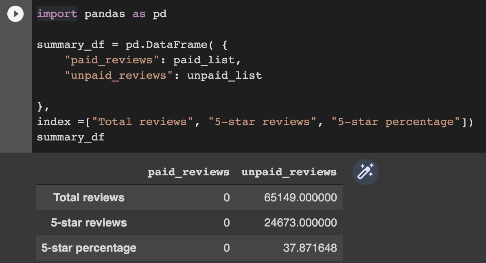

# Amazon_Vine_Analysis

## Overview

Amazon has a program in which it pays for reviews. The category analyzed here is Ebooks sold in the US. 

The purpose of this analysis is to comb through paid and unpaid reviews and find if there is a difference between their positivity taht could be affected by the financial incentive. 

The ammount of entries is very large, and since we verge into "Big Data" territory, a number of very specific tools must be used, namely Pyspark to handle the analysis, and PgAdmin connected to Amazon Web Services RDS to host the data.

## Results

All of these questions can be answered looking at the summary dataframe below:

- How many Vine reviews and non-Vine reviews were there?
- How many Vine reviews were 5 stars? How many non-Vine reviews were 5 stars?
- What percentage of Vine reviews were 5 stars? What percentage of non-Vine reviews were 5 stars?

## Summary

There is an interesting fact about the data analyzed, this is that none of the reviews are a part of the Vine program. This can be observed by looking at the summary dataframe where we can find that the paid_reviews_df is actually empty.

Given that the data does not contain information in that regard, it is impossible to make a comparisson, therefore no bias can be detected. Evidence of this can be seen in either of the two ipbyn files.

Under different circumstances we could use a t-test to find if there is a difference in the means of both the paid and unpaid reviews.
